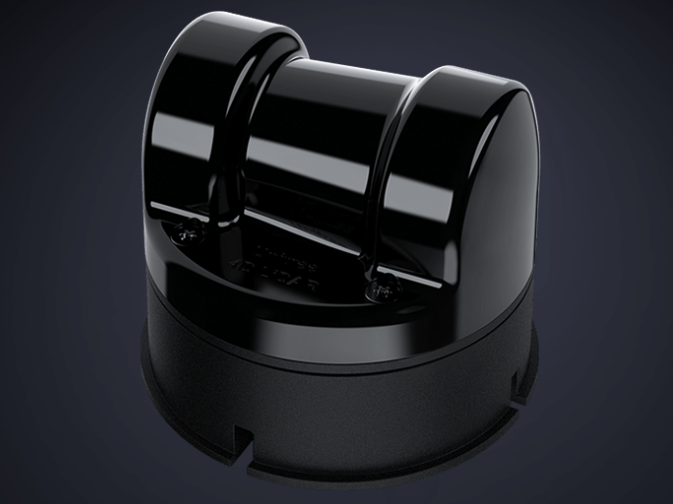

# unilidar sdk

## Introduction

This repository is a SDK for [Unitree L1 LiDAR](https://www.unitree.com/LiDAR).

You can use the code interfaces in this repository to obtain point cloud data and IMU data measured in our lidar, as well as configure related parameters. 

We provide three commonly used interfaces for our LiDAR:
- if you prefer to use the original **C++ SDK** directly, you can refer to [README.md](./unitree_lidar_sdk/README.md); 
- if you want to use **ROS**, you can refer to [README.md](./unitree_lidar_ros/src/unitree_lidar_ros/README.md); 
- if you are developing with the latest **ROS2**, you can refer to [README.md](./unitree_lidar_ros2/src/unitree_lidar_ros2/README.md).

  

