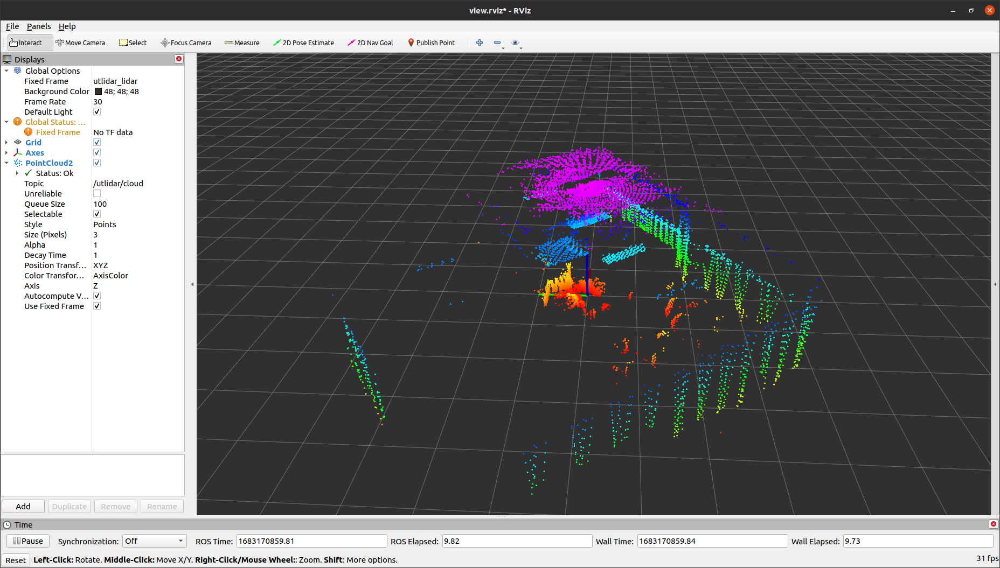
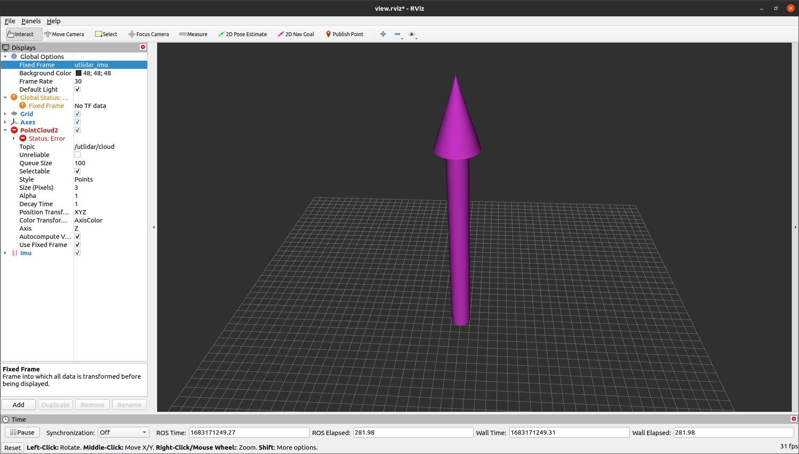

# Unitree Lidar ROS

## Introduction
This package is a ROS package, which is specially used for running Unitree LiDAR products.


The functions that this package can provide includes:
- Parse the raw data transmitted from the lidar hardware, and convert it into pointcloud and IMU data
- Publish the pointcloud data to a ROS topic
- Publish the IMU data to a ROS topic
- In addition, we provide a yaml file to configure the relevant parameters of the lidar.

## Dependency
The dependencies include `PCL` and `ROS`.

We have verified that this package can successfully run under this environment:
- `Ubuntu 20.04` 
- `ROS noetic`
- `PCL-1.10`
- `unitree_lidar_sdk`

You are suggested to configure an environment like this to run this package.


## Configuration

Connect your lidar to your computer with a USB cable, then confirm your serial port name for lidar:
```
$ ls /dev/ttyUSB*
/dev/ttyUSB0
```

The default serial port name is `/dev/ttyUSB0`.
If it is not the default one, you need to modify the configuration  in `unitree_lidar_ros/config/config.yaml`
and change the `port` name to yours. For example
```
# Serial Port
port: "/dev/ttyYourUSBPortName"
```

You can leave other parameters in the configuration file with their default value.

If you have special needs such as changing the cloud topic name or IMU topic name, you are allowed to configure them in the configuration file as well. 

The defalut cloud topic and its frame name is:
- topic: "unilidar/cloud"
- frame: "unilidar_lidar"

The defalut IMU topic and its frame name is:
- topic: "unilidar/imu"
- frame: "unilidar_imu"
  
## Build
You can just build this ROS package as follows:
- Clone the repository
```
git clone https://github.com/unitreerobotics/unilidar_sdk.git
```

- Compile
```
cd unilidar_sdk/unitree_lidar_ros

catkin_make
```


## Run
Then you need to source this ROS packege environment and then directly run the launch file:
```
source devel/setup.bash

roslaunch unitree_lidar_ros run.launch
```

In the Rviz window, you will see our lidar pointcloud like this:



You can change the `Fixed Frame` to the imu frame `unilidar_imu`, so that you can view the IMU quaternion vector:

